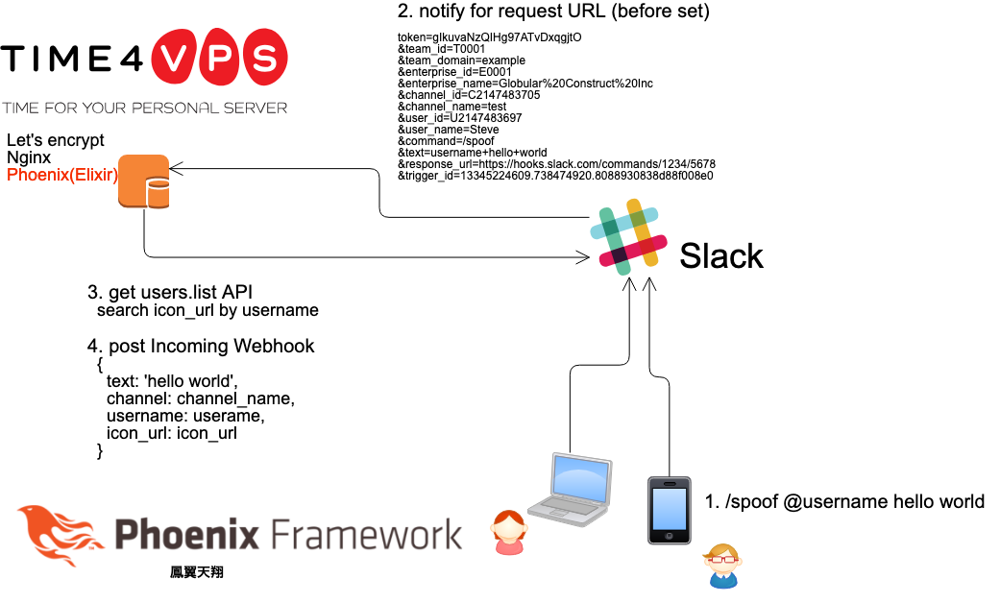
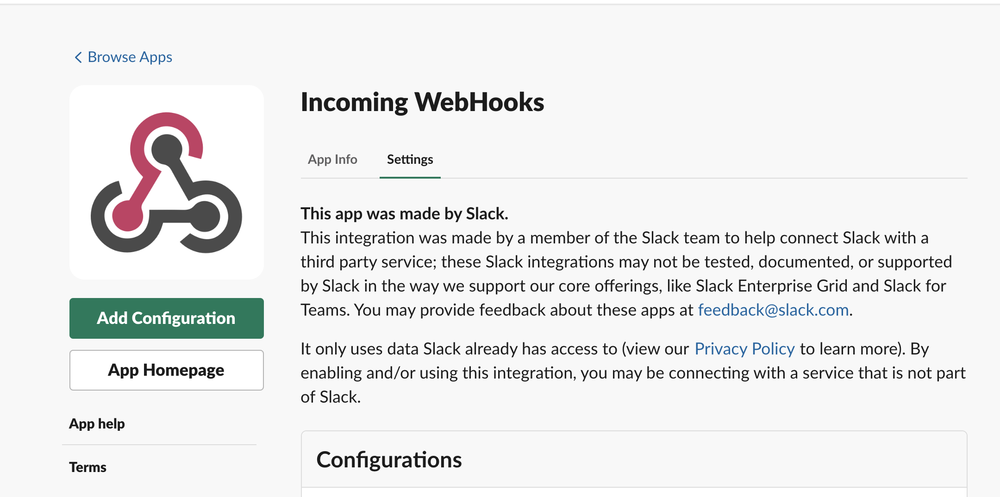

# Spoof



To start your Phoenix server:

  * Install dependencies with `mix deps.get`
  * Create and migrate your database with `mix ecto.create && mix ecto.migrate`
  * Install Node.js dependencies with `cd assets && npm install`
  * Start Phoenix endpoint with `mix phx.server`

Now you can visit [`localhost:4000`](http://localhost:4000) from your browser.

Ready to run in production? Please [check our deployment guides](http://www.phoenixframework.org/docs/deployment).

## Learn more

  * Official website: http://www.phoenixframework.org/
  * Guides: http://phoenixframework.org/docs/overview
  * Docs: https://hexdocs.pm/phoenix
  * Mailing list: http://groups.google.com/group/phoenix-talk
  * Source: https://github.com/phoenixframework/phoenix

# [Slack](https://www.slack.com)
- For example your workspace url is https://your-workspace.slack.com/

## [Slash Commands](https://api.slack.com/slash-commands)
- Please connect your endpoint and command.
- Please read [here](https://api.slack.com/slash-commands). I can do it, you can do it too!


## Set environment variable

### Use users.list API for getting icon
- [Legacy tokens](https://api.slack.com/custom-integrations/legacy-tokens)

```
export SLACK_YOUR_WORKSPACE_TOKEN="xoxp-..."
```

### Use Incoming WebHooks for posting message
- https://your-workspace.slack.com/apps/manage/custom-integrations
- Incoming WebHooks > Add Configuration

```
export SLACK_YOUR_WORKSPACE_WEBHOOK_URL="https://hooks.slack.com/services/..."
```


Enjoy spoofing!!!
